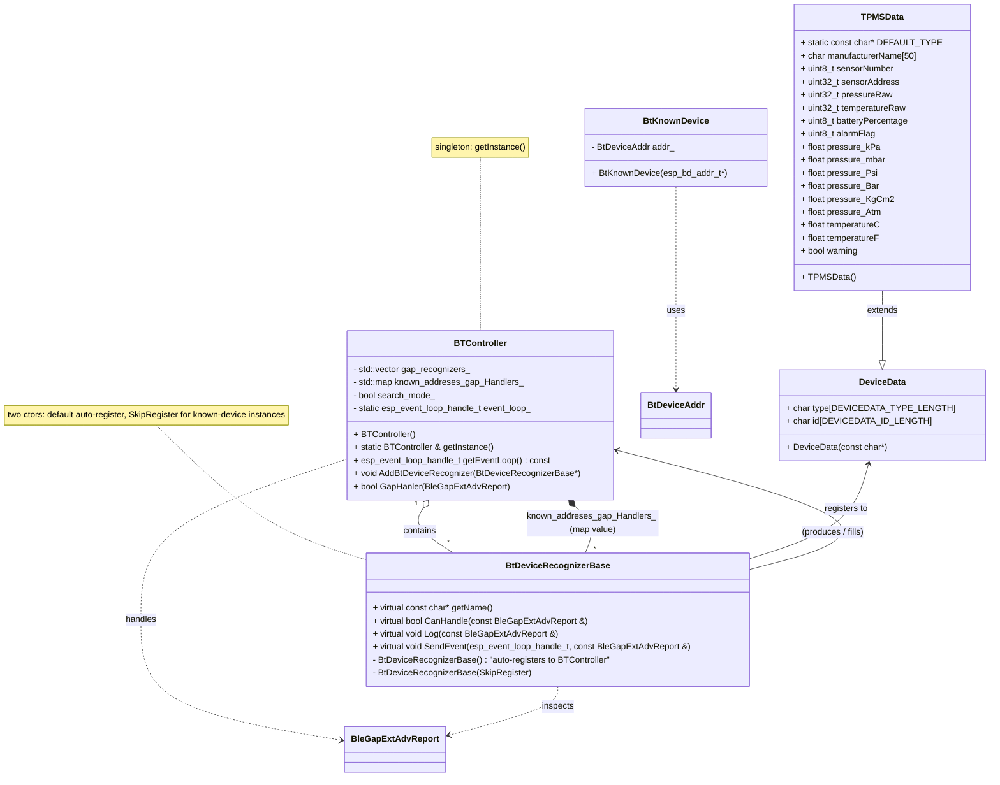

# Тест

```mermaid
classDiagram
    class BTController {
        - std::vector<BtDeviceRecognizerBase*> gap_recognizers_
        - std::map<BtDeviceAddr, BtDeviceRecognizerBase*> known_addreses_gap_Handlers_
        - bool search_mode_
        - static esp_event_loop_handle_t event_loop_
        + BTController()
        + static BTController & getInstance()
        + esp_event_loop_handle_t getEventLoop() const
        + void AddBtDeviceRecognizer(BtDeviceRecognizerBase*)
        + bool GapHanler(BleGapExtAdvReport)
    }
    BTController "1" o-- "*" BtDeviceRecognizerBase : contains
    BTController "1" *-- "*" BtDeviceRecognizerBase : known_addreses_gap_Handlers_ (map value)
    BTController ..> BleGapExtAdvReport : handles

    class BtDeviceRecognizerBase {
        + virtual const char* getName()
        + virtual bool CanHandle(const BleGapExtAdvReport &)
        + virtual void Log(const BleGapExtAdvReport &)
        + virtual void SendEvent(esp_event_loop_handle_t, const BleGapExtAdvReport &)
        - BtDeviceRecognizerBase()  "auto-registers to BTController"
        - BtDeviceRecognizerBase(SkipRegister)
    }
    BtDeviceRecognizerBase --> BTController : registers to
    BtDeviceRecognizerBase ..> BleGapExtAdvReport : inspects
    DeviceData <-- BtDeviceRecognizerBase : (produces / fills)

    class DeviceData {
        + char type[DEVICEDATA_TYPE_LENGTH]
        + char id[DEVICEDATA_ID_LENGTH]
        + DeviceData(const char*)
    }

    class TPMSData {
        + static const char* DEFAULT_TYPE
        + char manufacturerName[50]
        + uint8_t sensorNumber
        + uint32_t sensorAddress
        + uint32_t pressureRaw
        + uint32_t temperatureRaw
        + uint8_t batteryPercentage
        + uint8_t alarmFlag
        + float pressure_kPa
        + float pressure_mbar
        + float pressure_Psi
        + float pressure_Bar
        + float pressure_KgCm2
        + float pressure_Atm
        + float temperatureC
        + float temperatureF
        + bool warning
        + TPMSData()
    }
    TPMSData --|> DeviceData : extends

    class BtKnownDevice {
        - BtDeviceAddr addr_
        + BtKnownDevice(esp_bd_addr_t*)
    }
    BtKnownDevice ..> BtDeviceAddr : uses

    note for BTController "singleton: getInstance()"
    note for BtDeviceRecognizerBase "two ctors: default auto-register, SkipRegister for known-device instances"
```